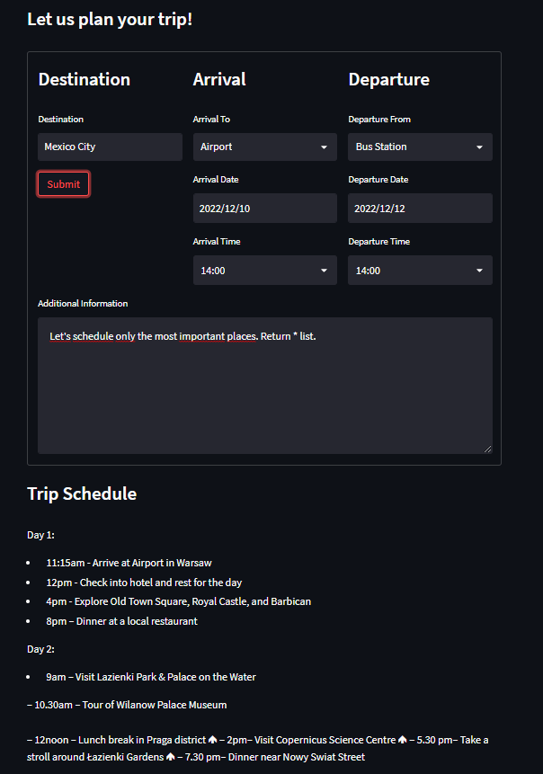
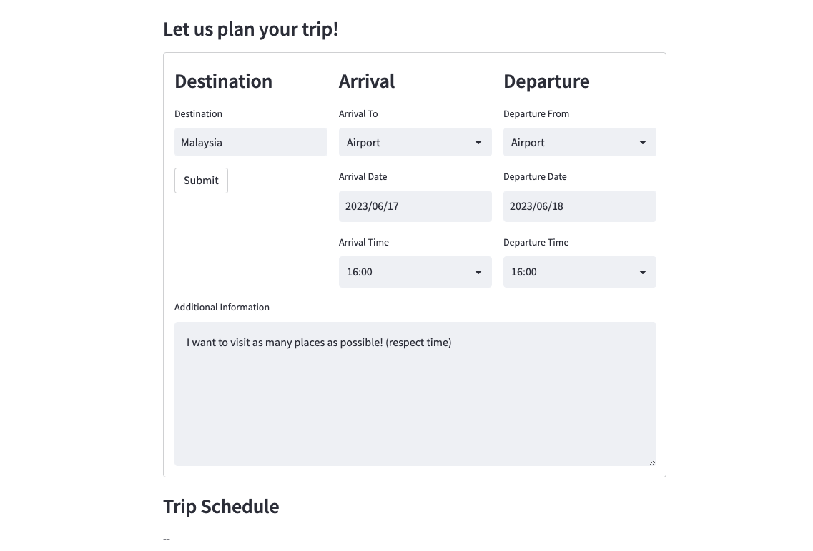

# Trip Planner

In this repo , I create a simple GPT-3 powered Streamlit service for **trip scheduling**. 

I will use GPT-3 to generate trip schedule based on user input and Streamlit to create simple UI for the app.

Technology : GPT-3, Streamlit



## Prerequisites

First, we need to install the necessary libraries:

```python
pip install openai
pip install streamlit
pip install python-dotenv
```

Now we can create `.env` file and add our OpenAI API key:

```
OPENAI_API_KEY=<your api key>
```

Last thing we need to do is to create [`main.py`](main.py) file, import all necessary libraries and load our API key from .env file

## Creating Streamlit app

First, we need to create a functions that will generate prompt and trip schedule based on user input. Below are the sample destination i used for this project:

```
example_destinations = ['Paris', 'London', 
'New York', 'Tokyo', 'Sydney', 'Hong Kong', 
'Singapore', 'Warsaw', 'Mexico City', 'Palermo']
```

## 🚀 Running Streamlit app
Now we can run our app:

```
streamlit run main.py
```

## 🏆 Result

And let's check results!




